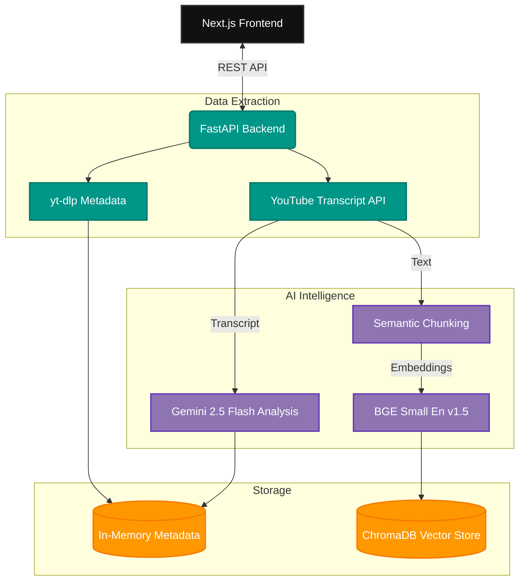
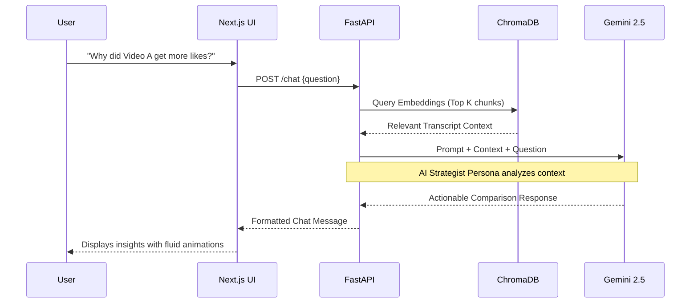

<div align="center">

# 🎬 Agentic VideoRAG

**AI-Powered Social Media Video Comparison & Intelligence**

[](https://nextjs.org/)
[](https://fastapi.tiangolo.com/)
[](https://deepmind.google/technologies/gemini/)
[](https://www.trychroma.com/)

<br/>


*Stop guessing why a video went viral. Start analyzing.*

</div>

---

## ⚡ Overview

**Agentic VideoRAG** is a full-stack intelligence platform built for content creators, marketers, and developers. It allows you to input URLs for any two social media videos (YouTube Shorts, Long-form, or Instagram Reels) and instantly receive a deep, AI-driven comparative analysis.

Instead of just looking at vanity metrics (views, likes), Agentic VideoRAG fetches the metadata and actual video transcripts, runs them through **Google's Gemini 2.5 Flash**, and stores them in a local **ChromaDB** vector database. 

You can then **chat directly with your videos** using a Retrieval-Augmented Generation (RAG) pipeline to ask specific questions like *"Why did Video A's hook perform better?"*

---

## ✨ Features

- 🚀 **Parallel Processing Pipeline:** Fetches metadata (`yt-dlp`) and captions (`youtube-transcript-api`) simultaneously for lightning-fast results.
- 🧠 **AI Content Analysis:** Automatically extracts Hooks, Summaries, Calls-to-Action, Target Audiences, and Key Topics.
- 💬 **Agentic RAG Chat:** Ask questions about the videos. The AI retrieves relevant transcript chunks using `BAAI/bge-small-en-v1.5` embeddings to provide evidence-based answers.
- 🎨 **Glassmorphism UI:** A stunning, modern Next.js interface with Tailwind CSS, custom design tokens, and fluid micro-animations.

---

## 🏗️ Architecture & Data Flow

### 1. System Architecture



### 2. RAG Chat Workflow



---

## 🚀 Getting Started

### Prerequisites
- Python 3.10+
- Node.js 18+
- A Google Gemini API Key

### 1. Backend Setup (FastAPI)

```bash
# Navigate to the backend directory
cd server

# Create and activate a virtual environment
python -m venv venv
source venv/bin/activate  # On Windows: .\venv\Scripts\activate

# Install dependencies
pip install -r requirements.txt

# Create an environment file
echo "GEMINI_API_KEY=your_api_key_here" > .env

# Run the backend server
uvicorn app.main:app --reload --port 8000
```

### 2. Frontend Setup (Next.js)

```bash
# Navigate to the frontend directory
cd client

# Install dependencies
npm install

# Run the development server
npm run dev
```

Visit `http://localhost:3000` to start analyzing videos!

---

## 🛠️ Tech Stack

### Frontend
- **Framework:** Next.js 15 (React 19)
- **Styling:** Tailwind CSS v4 + Vanilla CSS (Glassmorphism & animations)
- **Icons:** Lucide React / SVG

### Backend
- **Framework:** FastAPI
- **Concurrency:** Asyncio + ThreadPoolExecutor
- **Video Extraction:** `yt-dlp`, `youtube-transcript-api`

### AI & Vector Storage
- **LLM:** Google Gemini 2.5 Flash (`google-genai` SDK)
- **Embeddings:** `BAAI/bge-small-en-v1.5` (via `langchain-huggingface`)
- **Database:** ChromaDB (Local persistent/in-memory)

---

## 🤝 Contributing
Contributions are always welcome! Feel free to open a pull request or an issue if you have suggestions for improvement.

<div align="center">
  <br/>
  <p>Made with ❤️ for Video Creators and Analysts</p>
</div>
