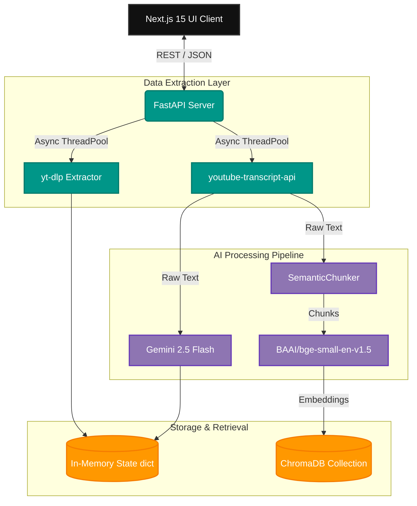
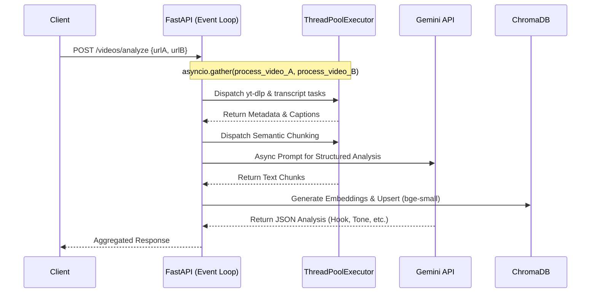

<div align="center">

# 🎬 Agentic VideoRAG

**AI-Powered Social Media Video Comparison & Intelligence Pipeline**

[](https://nextjs.org/)
[](https://www.typescriptlang.org/)
[](https://fastapi.tiangolo.com/)
[](https://www.python.org/)
<br/>
[](https://deepmind.google/technologies/gemini/)
[](https://www.trychroma.com/)
[](https://huggingface.co/BAAI/bge-small-en-v1.5)

<br/>


*An end-to-end RAG system for extracting, structuring, and chatting with multi-modal video metadata.*

</div>

---

## ⚡ Technical Overview

**Agentic VideoRAG** is a full-stack intelligence platform engineered to transform opaque video performance metrics into actionable, unstructured-to-structured insights. It ingests video URLs (YouTube, Instagram Reels), parallelizes metadata and transcript extraction, and utilizes Large Language Models (LLMs) alongside vector databases for deep content analysis and Retrieval-Augmented Generation (RAG).

Instead of relying solely on vanity metrics provided by native APIs, this system parses the **actual linguistic payload** of the videos, applying semantic chunking and embedding models to allow users to semantically query the content.

---

## 🏗️ System Architecture & Data Flow

The system operates on a decoupled client-server architecture, utilizing a Next.js App Router frontend and a high-concurrency FastAPI Python backend.

### 1. High-Level Architecture



### 2. Concurrency & Pipeline Execution

Video analysis is highly I/O bound (network requests to CDNs) and CPU bound (embedding generation). The backend leverages `asyncio` combined with `ThreadPoolExecutor` to prevent blocking the FastAPI event loop during synchronous library calls (like `yt-dlp` and `youtube-transcript-api`).



---

## 🔬 Core Components & Tech Stack

### 🖥️ Frontend Client (Next.js 15)
- **Framework**: React 19 + Next.js App Router.
- **Styling**: Tailwind CSS v4 alongside modular CSS for advanced glassmorphism and keyframe micro-animations.
- **State Management**: React Hooks (`useState`, `useEffect`) bridging API data to the UI.
- **Components**: Separated concern architecture (e.g., `VideoCard.tsx`, `ChatPanel.tsx`, `MessageBubble.tsx`).

### ⚙️ Backend API (FastAPI)
- **Concurrency**: Native `async`/`await` implementation. Synchronous blocking calls are offloaded via `asyncio.get_running_loop().run_in_executor()`.
- **Validation**: Pydantic v2 schemas for strict request/response typing.
- **CORS**: Configured to accept requests from standard React development ports.

### 🧠 Embedding & RAG Pipeline
- **Chunking Strategy**: Utilizes `langchain-experimental`'s `SemanticChunker`, which splits text based on semantic similarity rather than arbitrary character counts, preserving context bounds.
- **Embeddings Model**: `BAAI/bge-small-en-v1.5` (via `sentence-transformers`). Chosen for its high performance-to-latency ratio on standard CPU deployments.
- **Vector Store**: **ChromaDB**. Stores document chunks and vectors in `./chroma_db` for persistence across sessions.
- **Retrieval Logic**: Cosine similarity nearest-neighbor search (`n_results=3`), dynamically clamped if the document count is lower than the requested `k`.

### 🤖 LLM Interfacing
- **Model**: Google `gemini-2.5-flash`.
- **SDK**: Supports the modern `google-genai` SDK with a fallback to `google.generativeai`.
- **Fallbacks**: Custom robust text extraction logic handles edge cases where models return complex `candidates` blocks or lack direct `.text` attributes (e.g., during "thinking" phases).

---

## 📡 API Endpoints Reference

| Endpoint | Method | Description |
| :--- | :--- | :--- |
| `/videos/analyze` | `POST` | Accepts `video_a` and `video_b` URLs. Initiates parallel extraction, chunking, and AI analysis. Returns structured metadata. |
| `/chat/` | `POST` | The RAG endpoint. Accepts a user query, embeds it, queries ChromaDB for contextual chunks from both videos, and prompts Gemini for a comparative answer. |
| `/videos/reset` | `GET` | Clears the ChromaDB collection and in-memory state. Used when initiating a new analysis session. |
| `/videos/metadata`| `GET` | Returns the current state of extracted video metadata. |
| `/videos/debug` | `GET` | Returns vector store stats (chunk counts, IDs) for debugging. |

---

## 🚀 Local Development Setup

### Prerequisites
- Python 3.10 or higher
- Node.js 18 or higher
- [Google Gemini API Key](https://aistudio.google.com/app/apikey)

### 1. Backend Setup

```bash
# Clone the repository and navigate to the backend
cd Agentic-VideoRAG/server

# Create and activate a virtual environment
python -m venv venv
source venv/bin/activate  # On Windows: .\venv\Scripts\activate

# Install dependencies
pip install -r requirements.txt

# Configure Environment Variables
# Create a .env file in the /server directory
echo "GEMINI_API_KEY=your_gemini_api_key_here" > .env
# Optional: GEMINI_MODEL=gemini-2.5-flash

# Start the FastAPI server (Runs on port 8000)
uvicorn app.main:app --reload --port 8000
```

### 2. Frontend Setup

```bash
# Navigate to the frontend directory
cd ../client

# Install Node dependencies
npm install

# Start the Next.js development server (Runs on port 3000)
npm run dev
```

Visit `http://localhost:3000` to interact with the application.

---

## 🔮 Future Architecture Roadmap

While currently optimized for local execution and rapid prototyping, production deployment would involve:
1. **Message Queues**: Replacing `ThreadPoolExecutor` with **Celery/Redis** for distributed task processing of heavy video extraction jobs.
2. **Persistent RDBMS**: Migrating the in-memory `video_metadata` dictionary to **PostgreSQL** to handle concurrent, multi-tenant user sessions.
3. **Managed Vector DB**: Migrating from local ChromaDB to a managed instance (e.g., Pinecone or Qdrant Cloud) for horizontal scaling.
4. **Whisper Fallback**: Implementing an OpenAI Whisper fallback pipeline for videos lacking native closed captions.

---

<div align="center">
  <p>Engineered for high-throughput video intelligence.</p>
</div>
